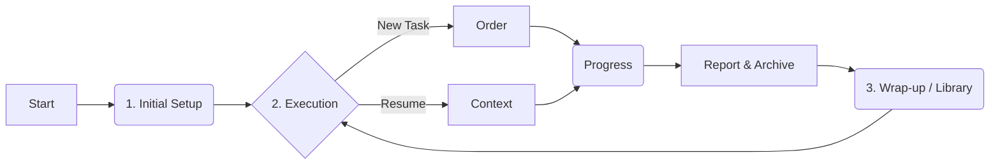
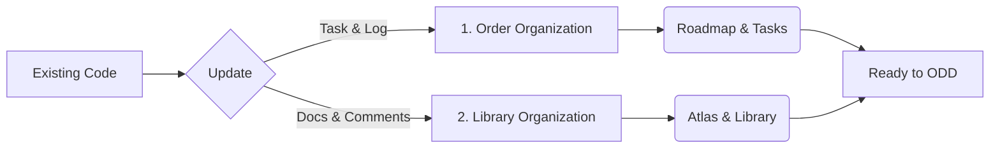
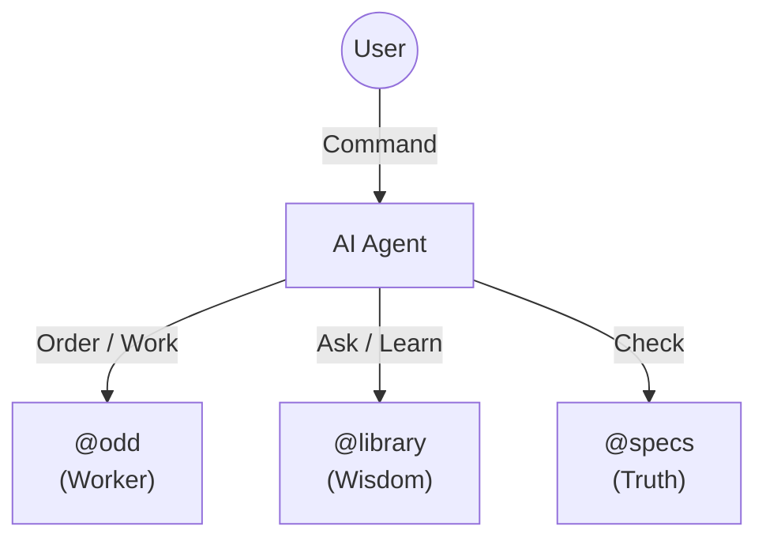

# 🚀 ODD Starter Kit (v0.9.0 Standard Edition)

> **"AI 개발의 기억 상실증을 치료하라."**  
> Order Driven Development (ODD) v0.9.0: Library & Atlas Framework

---

## 🛠️ 1. 설치하기 (One-step Installation)

어떠한 환경에서도 터미널에서 아래 명령어를 실행하면, 즉시 ODD 시스템이 구축됩니다.

```bash
curl -sL https://raw.githubusercontent.com/imincheol/odd-starter/main/odd/setup/install.sh | bash
```
*(설치 후에는 `docs/` 폴더가 생성되며, 사용자의 기존 데이터는 안전하게 보존됩니다.)*
*(추후 시스템 업데이트 시에는 `docs/odd/setup/install.sh`를 실행하세요.)*

```
docs/
├── odd/                # 🧠 Operation & Memory
│   ├── ATLAS.md        #    - Single Source of Truth
│   ├── roadmap.md      #    - Project Snapshot
│   ├── tasks/          #    - Working Memory (Active Orders)
│   ├── books/          #    - Long-term Memory (Domain Knowledge)
│   ├── history/        #    - Chronicles (Daily Logs)
│   ├── archive/        #    - Completed Memory (yyyy/mm/dd)
│   └── setup/          # │   │   ├── setup/
│   │   │   ├── ODD_INIT.md
│   │   │   ├── ODD_UPDATE.md
│   │   │   └── install.sh  #    - Update Script
│
└── specs/              # 🏛️ Product Specifications
    ├── README.md       #    - Product Overview
    ├── 1_planning/     #    - Requirements
    ├── 2_design/       #    - UI/UX
    └── ...             #    - Markup, Development
```

### ⚠️ 필수 설정 (Required Setup)
프로젝트 루트에 있는 **`docs/odd/ATLAS.md`** 파일의 내용을 복약하여, 사용 중인 AI(ChatGPT, Claude, Cursor 등)의 **System Prompt(Custom Instructions)**에 붙여넣으세요.
이 설정이 되어야 AI가 프로젝트의 정체성과 ODD 프로세스를 이해하고 올바르게 동작합니다.

---

## 📖 2. 사용자 가이드 (User Guide)

프로젝트 상황에 맞는 가이드를 선택하여 진행하세요.

### 🆕 A. 신규 프로젝트 (New Project)



#### 1️⃣ 초기 설정 (Initial Setup)
아무것도 없는 상태에서 시작할 때, 기획안을 기준으로 시스템을 구축합니다.

> **💡 Smart Start:**  
> **`docs/odd/setup/ODD_INIT.md`** 파일을 현재 채팅창에 업로드하거나 내용을 복사해서 AI에게 건네주세요.  
> AI가 프로젝트 인터뷰부터 스펙 정리, 로드맵 수립까지 자동으로 진행해줍니다.

#### 2️⃣ 실전 개발 (EXECUTION)

**Situation 1: 신규 작업을 시작할 때**
새로운 기능을 개발하거나 작업을 시작하는 단계입니다.

> **💬 1. 주문 생성:**  
> "`@odd` 로드맵 1순위 작업을 위해 `@specs`를 확인하고 오더(Order) 초안을 작성해줘."
>
> **💬 2. 주문 진행:**  
> "(사용자 승인 후) 승인했어. 오더에 따라 `progress.json`을 업데이트하면서 작업을 진행해줘."
>
> **💬 3. 주문 완료:**  
> "작업이 끝났으니 `report.json`을 작성하고 태스크를 `docs/odd/archive/yyyy/mm/dd/` 폴더로 이동하여 아카이브해줘."

**Situation 2: 이전 작업을 이어서 할 때 (Resume)**
세션이 끊겼거나 다음 날 작업을 재개하는 단계입니다.

> **💬 1. 맥락 파악:**  
> "`@odd` 현재 `roadmap.md`의 진행 상태와 `tasks/` 폴더에 있는 오더를 확인해서 상황을 파악해줘."
>
> **💬 2. 주문 진행:**  
> "파악된 오더의 `progress.json`을 보고 이어서 작업을 진행해줘."
>
> **💬 3. 주문 완료:**  
> "작업이 끝났으니 리포트를 작성하고 `docs/odd/archive/yyyy/mm/dd/` 폴더로 이동하여 아카이브해줘."

#### 3️⃣ 개발 정리 (WRAP-UP)
작업이 어느 정도 쌓였을 때, 도서관(지식)을 정리합니다.

> **💬 라이브러리 정리 프롬프트:**  
> "지금까지 `@odd` 아카이브에 쌓인 리포트들을 분석해서, `@library`의 도메인 지식을 보강해줘. 그리고 **책들 간의 시냅스 연결**을 강화해줘."

---

### 🏙️ B. 기존 프로젝트 (Existing Project)



#### 1️⃣ 시스템 업데이트 (System Update)
기존 프로젝트를 ODD 시스템으로 변환하거나 현행화합니다.

> **💡 Smart Update:**  
> **`docs/odd/setup/ODD_UPDATE.md`** 파일을 현재 채팅창에 업로드하거나 내용을 복사해서 AI에게 건네주세요.  
> AI가 현재 프로젝트의 **코드 분석, 기술 스택 파악, 로드맵 현행화**를 일괄적으로 수행합니다.

---

## 🧭 3. 참조 가이드 (Reference Context)



효율적인 협업을 위해, AI를 부를 때 **역할(@Context)**을 지정해 주세요.

| 참조 대상 | 역할 (메타포) | 언제 사용하나요? |
| :--- | :--- | :--- |
| **`@odd`** | **워커 (Worker)** | "작업 시작해줘", "진행 상황 알려줘" (Tasks, Roadmap, History) |
| **`books`** | **지식 (Wisdom)** | "이 개념이 뭐야?", "기술 스택 확인해줘" (Domain, Tech) |
| **`specs`** | **기준 (Truth)** | "기획 의도가 뭐야?", "스펙 확인해줘" (Specifications) |

---

## 💡 팁 (Pro Tips)

*   **세션 시작 시**: 항상 `ATLAS.md`와 `roadmap.md`를 먼저 공유하여 맥락을 동기화하세요.
*   **승인(Approve)**: AI가 작성한 `order.json`을 보고 **"승인"**해야 실제 코딩이 시작됩니다.
*   **시냅스(Synapse)**: 아틀라스는 도메인의 목록만 관리(불변)하고, 실제 지식의 연결은 각 도메인 문서 내부에서 시냅스로 연결합니다.
